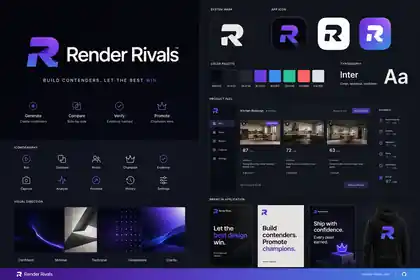
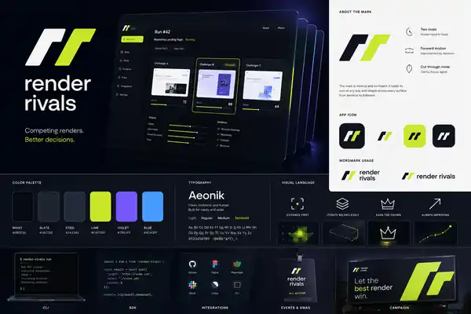

# Render Rivals Brand Exploration

This directory contains logo and visual-direction explorations. Generated boards are exploratory references, not final production assets or proof of shipped UI.

## Core brand idea

Render Rivals is an evidence-backed local developer tool for comparing implementations. The identity should communicate:

- two implementations under comparable conditions;
- inspection and cited judgment rather than taste alone;
- recommendation and deliberate human choice;
- local-first developer tooling;
- confidence, quality, and forward motion without aggression.

The brand must not imply that evaluation is perfectly objective, that one universal score determines quality, or that Recommendation automatically changes source.

## Current working language

- Product name: **Render Rivals**
- Primary line: **Build contenders. Keep the best.**
- Supporting lines under review:
  - **Compare implementations. Keep the evidence.**
  - **Better interfaces, proven under the same conditions.**
  - **Capture fairly. Decide deliberately.**

Avoid using “winner,” “champion,” “battle,” or “promote” as core product vocabulary even when older concept boards contain those themes.

## Concept boards

### 01 — Arena / purple and orange

A competitive-tech exploration with mirrored forms and purple/orange contrast. Useful as a reference for duality, but too arena-like for the final product if adopted literally.

### 02 — Evidence / editorial

A calmer analytical direction centered on comparison, evidence breakdowns, and editorial presentation.

### 03 — Premium champion

A dark-and-gold historical concept board. Its tournament/champion language is not canonical product vocabulary and should not drive the shipped system.

### 04 — Neon creative technology

A high-energy developer-tool direction with purple, electric blue, and lime accents. Useful for accent exploration but potentially less durable and less instrument-like.

### 05 — Minimal R monogram

A simpler monogram exploration that begins moving away from arena imagery.

### 06 — Twin slash lime

A paired-form exploration using restrained dark surfaces and a lime accent.

## Active double-R exploration

A double-R mark is now an active direction to explore rather than an excluded idea.

Requirements:

- read as two related implementations, not one generic stylized `R` duplicated mechanically;
- remain legible at favicon, tray, CLI, and app-icon sizes;
- work in one color before accent color is added;
- avoid lightning-bolt, crown, trophy, sword, arena, esports, and generic AI-gradient cues;
- avoid accidental resemblance to automotive, fashion, cryptocurrency, or sports-team marks;
- allow current/Contender distinction without permanently assigning “winner” color;
- support horizontal wordmark, square icon, monochrome, reversed, and accessible UI variants;
- be redrawn as an original vector and screened for trademark conflicts before release.

The double-R may use overlap, mirrored construction, shared negative space, sequential paths, or evidence/selection geometry. It should feel like a technical instrument and not a combat emblem.

## Recommended visual synthesis

1. Use Concept 02’s clarity and evidence structure for the product UI.
2. Borrow only restrained duality from Concepts 01, 05, and 06.
3. Keep typography precise, neutral, and durable.
4. Reserve semantic success colors for verified states rather than branding the Contender as a permanent winner.
5. Explore a distinctive double-R through shared geometry or negative space.
6. Test the mark without gradients and at 16, 20, 24, 32, and 48 pixels before choosing a direction.

## Asset policy

- Generated boards are reference material.
- Final logos/icons/UI assets are original vectors.
- Every final asset has source vector, monochrome/reversed variants, clear-space/minimum-size rules, accessible contrast, and export inventory.
- Brand filenames may retain historical concept wording, but UI/schema/product copy follows canonical terminology.
- No generated concept is used in a package, website, or product screenshot until selected, redrawn, and reviewed.
