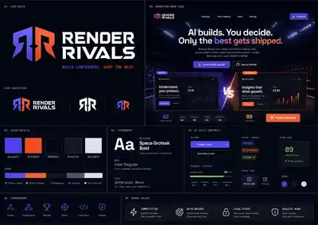
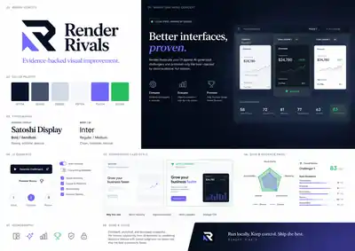
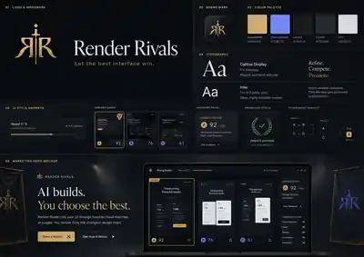
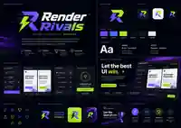

# Render Rivals Brand Exploration

This directory contains the initial logo and visual-direction explorations for Render Rivals. These boards are exploratory references, not final production assets.

## Core brand idea

Render Rivals is a competitive, evidence-backed visual optimization tool. The identity should communicate:

- contenders competing under comparable conditions;
- objective evaluation rather than taste alone;
- promotion of the strongest implementation;
- local-first developer tooling;
- confidence, quality, and forward motion.

## Current working language

- Product name: **Render Rivals**
- Primary line: **Build contenders. Keep the best.**
- Supporting alternatives:
  - **Compete. Compare. Promote.**
  - **Let the best interface win.**
  - **Better interfaces, proven.**

## Concept boards

### 01 — Arena / purple and orange

A direct competitive-tech direction with mirrored rivals, arena lighting, purple/orange contender states, and a bold geometric wordmark.

### 02 — Evidence / editorial

A calmer, analytical direction centered on proof, comparison, score breakdowns, and an editorial presentation style.

### 03 — Premium champion

A restrained dark-and-gold direction built around tournament language, promotion, judgment, and premium craft.

### 04 — Neon creative technology

A high-energy developer-tool direction with purple, electric blue, and lime accents. Strongest for social assets and app-store visibility, but potentially less timeless.

## Recommended synthesis

The strongest product direction is a synthesis rather than a direct adoption of any single generated board:

1. Use the clarity and comparison structure of **Concept 02** for the application UI.
2. Use the competitive energy and two-sided color system of **Concept 01** for marketing moments.
3. Keep the typography and restraint closer to **Concept 02**, avoiding esports styling.
4. Reserve winner green for verified promotion states, not general branding.
5. Build the final symbol around two opposing forms converging into one selected path, without relying on a generic trophy, sword, lightning bolt, or literal `RR` monogram.

## Asset policy

Generated boards are reference material. Final logos, icons, and interface assets should be redrawn as original vectors with tested small-size legibility, monochrome variants, accessible contrast, and trademark screening before release.
